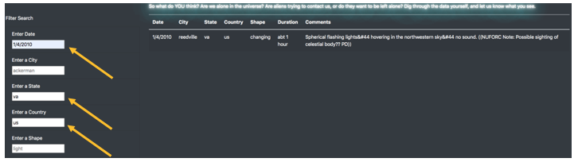

# UFO Sightings

## Background
Dana, a data journalist, has developed a webpage to offer the UFO sighting information she has come across in her research.  This is a topic she has been extremely interested in since she was a small child hearing of a sighting in her home state of Oregon.   


By using filters and a dynamic table, she has created a clean, well-working site that allows the user to query the table by a single date; and if the date is not found in the table, the table returns the entire dataset.

So not surprising, she would like to not only provide a deeper drill-down view of the data by allowing for multiple filters, she would also like to keep up the professional look. 

## Objective
The main objective of this project is to add multiple, simultaneous filters to the UFO sightings table. Filter criteria will include:

1. Date
2. City
3. State
4. Country
5. Shape of UFO 

The code should eliminate the need for the "Filter" button that is currently utilized, and the updates for (or changes on) the filter input will be "heard" once the value of the input is changed.

Of course, this objective needs to be accomplished while keeping the professional feel of the website.

## Process
### Resources:
This process involves using the following tools:

*  **JavaScript** for the script coding implementing the Data-Driven Documents (**D3.js**) library to allow for more streamlined code.
*  **HTML** for the web deisgn implementing **Bootstrap 3** elements and **CSS** styling.


### Code Enhancements:
Code enhancements necessary to achieve our objectives include:

*  Instead of using a "Filter" button to register or "hear" the filter input: ```d3.select("#filter-btn").on("click", updateFilters);```   

  this new code utilizes  .on("change", function) to "listen" for changes in the input
```d3.selectAll("input").on("change", updateFilters);```

*  An ```updateFilters``` function utilizes ```d3.select(this)``` to capture all the filters that were changed and proceeds to create a variable to capture the "value" and the "id" of the input which is used to loop through the dataTable.

*  A "forEach" loop is used to loop through the search criteria captured in the ```updateFilters``` function:
```Object.entries(filters).forEach(([key, value]) => {
  filteredData = filteredData.filter(row => row[key] === value)
});``` 

*  Additional CSS elements were added to hopefully make the page a little more eye-catching
	*  from [https://freefrontend.com/css-glow-text-effects/](): alien-green glowing text; Matt Smith on August 21, 2017
	*  from [https://gifs.alphacoders.com/gifs/view/11666](): a sci-fi UFO gif file; author unknown


## Functionality
The "Truth Is Out There" page defaults to displaying the full data table of UFO Sightings Dana has compiled; the user can return to this status by clicking on the UFO Sightings tab in the navigation bar in the upper left-hand corner.  This reloads the entire page.


The page is rather straightforward and the search function is very simple: 

1. Enter (type) search criteria into any (or as many) of the 5 search options 
2. As soon as the "enter" button is hit or the cursor is clicked away from the input box, the resulting data table is displayed to the right.
**Example:** All sighting in the United States (us) on January 4, 2010


3. the users can drill down further by adding additional criteria to a preliminary search. **Example:** add the state of Virginia (va):

 
4. or simply remove criteria no longer needed and add new criteria as needed. **Example:** remove 3 criteria (date: 1/4/2010, country: us, and state: va) and add 1 new criteria (state: fl)


Perusing through the data using these search criteria is easy and dynamic, but there are some drawbacks and further fine-tuning is needed.


## Drawbacks and Steps Forward
While the website is doing exactly what it set out to do there are **some drawbacks**, and therefore areas for improvement for our next version.

* One **small drawback** noticed - and addressed while refactoring the code - is a **Reset Filters** button.    
  
While the **filters and table data do not need to be reset to start another search**, the filters do need to be removed or replaced as search parameters change.  When a user searches on 4 criteria but then wants to go back to using only 1, for example, the user needs to clear the other 3 filters.  

	*You can also use the UFO Sightings tab on the navigation bar, but the user needs to scroll up to the top. Having a button saves clicks and time.*

* One of **the biggest drawbacks** of the code, as it is originally written, **involves the format of the input data**.  The data table text is all lowercase, even the state and country abbreviations.  Without calling an addditional function like ```.toLowerCase()```, the input captured by the filter will not result in a value match unless it is in all lowercase: 

For example, if the user enters in "CA" instead of "ca" for the state filter, no results render:


Change the state search criteria to "ca" and it works!


This can be, and was addressed, by updating the code (in line 37) to reflect:
     ```let elementValue = changedElement.property("value").toLowerCase();```
     
Now if you enter "CA" in the state filter, this is what you see:


* Still on the subject of search criteria, without a **drop-down menu** to choose from, the **Shape** filter is not very user-friendly, particularly because it is not obvious what shapes the table includes (e.g. light is a shape?).  To make it more user friendly, the input for the **shape filter should allow for drop-down menu**.

* Similarly, **adding an alert** if no data is found would be helpful! 

However, many of these drawbacks can be addressed if we **embed filters to the table functionality** rather than presenting as separate text-input search criteria.

Other enhancements could include:

* a **"Download" button** for UFOligists who would like to do further analysis on their own, especially as the data table grows over the years, would be another simple enhancement. 
* additional visualization would be fabulous...maybe a **google map with markers** on the cities the UFO sightings occurred...*looks like California is a bit of a hot spot!*
